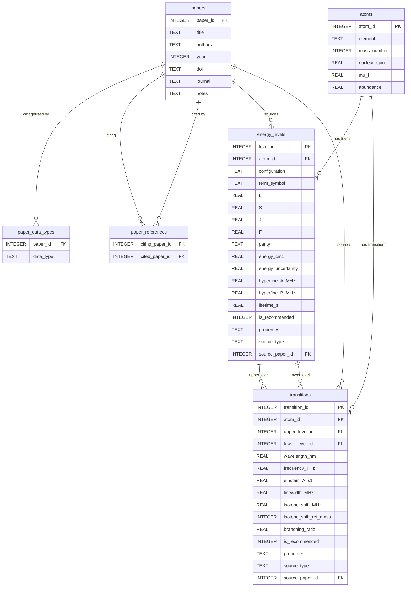

# AtomicRabbit — Database ERD

```mermaid
erDiagram
    atoms {
        INTEGER atom_id PK
        TEXT    element
        INTEGER mass_number
        REAL    nuclear_spin
        REAL    mu_I
        REAL    abundance
    }

    papers {
        INTEGER paper_id PK
        TEXT    title
        TEXT    authors
        INTEGER year
        TEXT    doi
        TEXT    journal
        TEXT    notes
    }

    paper_data_types {
        INTEGER paper_id    FK
        TEXT    data_type
    }

    paper_references {
        INTEGER citing_paper_id FK
        INTEGER cited_paper_id  FK
    }

    energy_levels {
        INTEGER level_id           PK
        INTEGER atom_id            FK
        TEXT    configuration
        TEXT    term_symbol
        REAL    L
        REAL    S
        REAL    J
        REAL    F
        TEXT    parity
        REAL    energy_cm1
        REAL    energy_uncertainty
        REAL    hyperfine_A_MHz
        REAL    hyperfine_B_MHz
        REAL    lifetime_s
        INTEGER is_recommended
        TEXT    properties
        TEXT    source_type
        INTEGER source_paper_id    FK
    }

    transitions {
        INTEGER transition_id          PK
        INTEGER atom_id                FK
        INTEGER upper_level_id         FK
        INTEGER lower_level_id         FK
        REAL    wavelength_nm
        REAL    frequency_THz
        REAL    einstein_A_s1
        REAL    linewidth_MHz
        REAL    isotope_shift_MHz
        INTEGER isotope_shift_ref_mass
        REAL    branching_ratio
        INTEGER is_recommended
        TEXT    properties
        TEXT    source_type
        INTEGER source_paper_id        FK
    }

    atoms           ||--o{ energy_levels    : "has levels"
    atoms           ||--o{ transitions      : "has transitions"
    papers          ||--o{ paper_data_types : "categorised by"
    papers          ||--o{ paper_references : "citing"
    papers          ||--o{ paper_references : "cited by"
    papers          ||--o{ energy_levels    : "sources"
    papers          ||--o{ transitions      : "sources"
    energy_levels   ||--o{ transitions      : "upper level"
    energy_levels   ||--o{ transitions      : "lower level"
```

